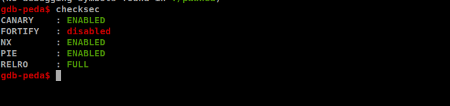
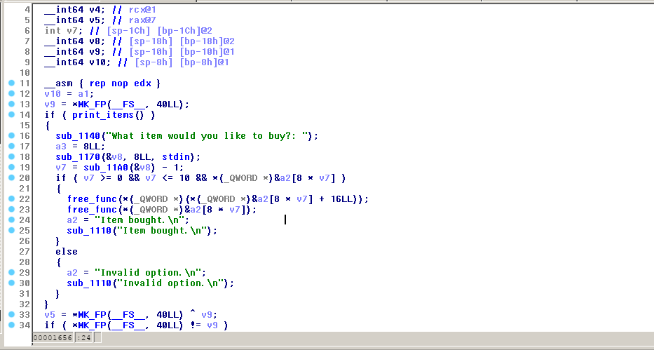
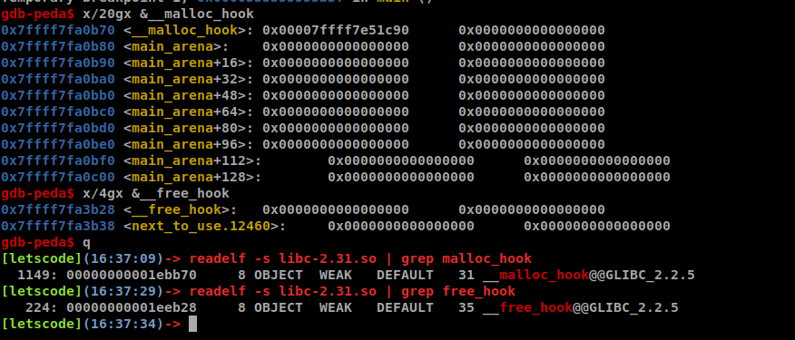
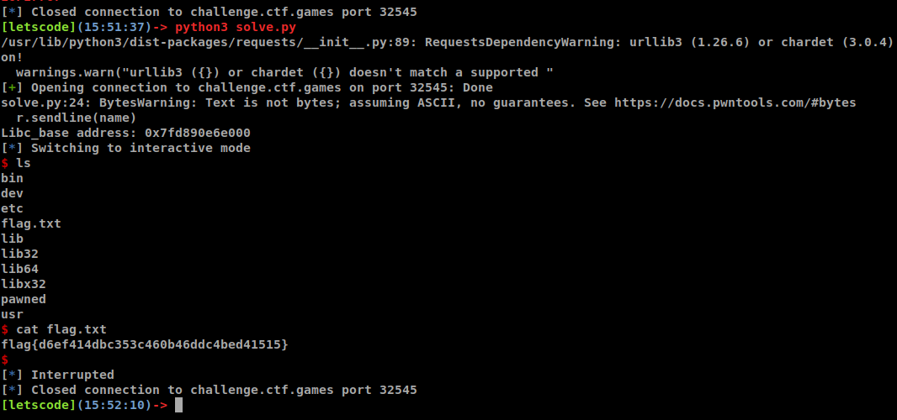

# Problem

```sh
Author: @M_alpha#3534

Welcome to our pawn shop. Only used items are allowed.

Download the files below and press the Start button on the top-right to begin this challenge.

Attachments: [pawned] [libc-2.31.so]
```

# Solution
- Almost Full protection.  



- In `buy_item` function, `free` but do not set the place where that heap address stored to Zero --> **Double Free**. But After `libc2.29` was updated, now it's `libc-2.31`, it makes `double free attack` harder to exploit. Find another `vulnerability`.  



- In `manage_items`, we can edit **freed item** because of the `previous vulnerability` --> **Use After Free**

- The plan is:
	+ Leak libc_base: create 2 big chunks, free them, use `print_items` function to leak `libc address` via `main_arena+96`
	+ Overwrite **__free_hook** by `system` (`one_gadget` not work in both `__malloc_hook` and `__free_hook`): Create 2 chunks (1, 2) with the same and small size, free(1) free(2). Now using `manage_items` to edit chunk2 with address of `__free_hook`. Create a chunk with the same size as privious 2 chunks, sending a string "/bin/sh\x00", so when being `free`, it goes to `__free_hook` and execute `system` with that address as argument. Create the last chunk with same size, now `malloc` return to us address of `__free_hook`, overwrite with address of `system` in there. Next time, just `free` a chunk having the string "/bin/sh\x00" -> we get shell.  



- Well that's all and we can get the flag, you can find the script [here](solve/solve.py)




## Thanks for reading :xD