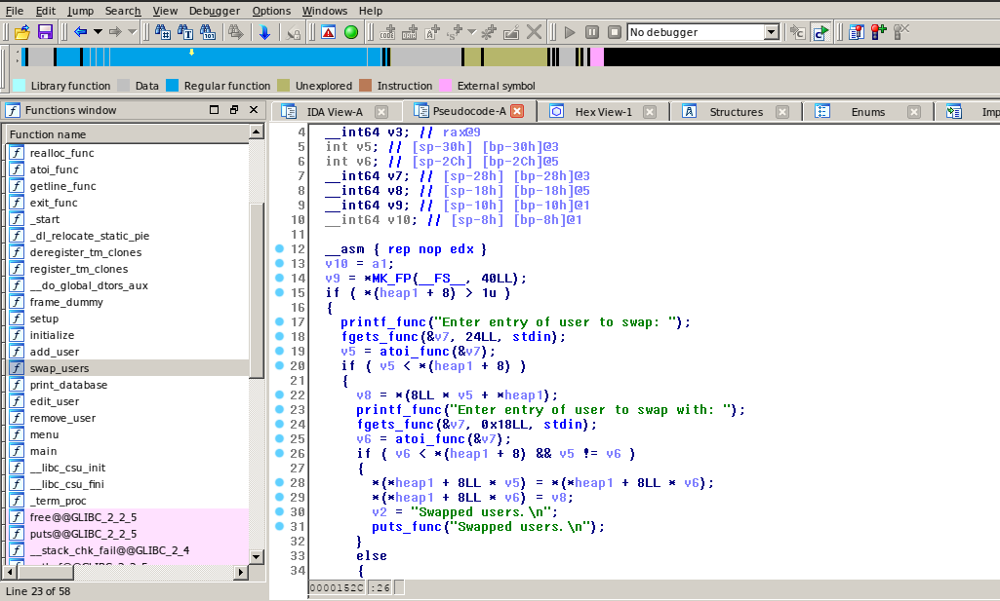
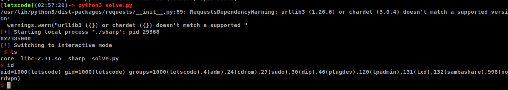

# Problem

```sh
At the time I solve this, the event was over and the web server is down. 
So I can't copy the description of this challenge here but I still have these files. 
Take a look and enjoy :vv
Attachments: [libc-2.31.so] and [sharp] 
```

# Solution
- After downloading [sharp](challenge/sharp), just open it in IDA-64bit and you will see the vulnerabilty in `swap_users` function. Look at `line 7, 8, 24`, we have overflow in `v7`, it makes `v8` can be overwrited and in our control (`8 byte`). Using it and at `line 29`, we can control a `value` in `heap`.




- Now let's leak `libc base address` by using `swap_users` function and make `v8` point to `free in GOT Table`. Then just using `print_database` function to leak `free libc address` and now we have `libc base address`. Next, we need to overwrite somewhere, because of `RELRO` is `FULL`, we can't overwrite `GOT Table`. So next target is `__free_hook`. After `swap_users` we have `__free_hook address` in heap, let's use `edit_user` function to edit it but **I fail** because it uses `fgets` to write to `__free_hook` but the `size` will be taken from `__free_hook - 8` (kind of size of heap chunk) and you know there is only `NULL` byte around `__free_hook` so `size` of `fgets` always `zero` -> we can't overwrite `__free_hook`. So next target is `__malloc_hook` and `__realloc_hook`, but both of them fail because `one_gadget` not working ----> **I'm stuck, I have nowhere to overwrite to execute one_gadget ... Do you know the feeling of controling RIP but CAN NOT control the program? :abcxyz**  


- Well, you know We are pwner, we can't just give up like that. After a day for researching and googling I found [this article](https://lkmidas.github.io/posts/20210103-heap-seccomp-rop/). This is an technique to `bypass seccomp` using `ROP chain` in `heap`. Despite of the problem of these two challenges is not the same BUT it's a `powerful technique` and very useful to me. After understanding this technique, I started to build the `payload` for my challenge and make the plan. First we need to leak `heap base address`. After `find` it in `gdb-peda`, I know the `heap base address` is stored in `<mp_ + 72>` of `libc` file (`mp_` is the global variable, I guess :vv). Now using the same technique as leaking `libc base address` we can leak `heap base address`. Now you now I can control `the first argument` of `realloc` in `add_user` function _ it is in `heap_base + 0x2a0`. But still untouch it until we build and add my `ROP chain` into the `heap` (This `ROP chain` just set `value` for `all registers` and run `syscall`). After adding the `payload` into heap, now we can change the value in `heap_base + 0x2a0` to `address of our payload`. Now we control `rdi` of `realloc` in `add_user`. Next we will overwrite `__realloc_hook` with address of this gadget **mov edx, dword ptr [rdi + 8] ; mov qword ptr [rsp], rax ; call qword ptr [rdx + 0x20]**. It works perfectly with `my payload` because we've already control `rdi` when this `gadget` is called. And now with this [script](solve/solve.py), shell belongs to us :haha  




> Well, In this challenge, there are 2 vulnerabilities. The first one is in `swap_users` function, and I've already exploited it successfully in this writeup. The second vulnerability is in `edit_user` function, It's about `heap exploitation technique` for `libc-2.31.so` and I'll write a writeup for it soon. Just waiting for it, byebye you guys :vv


## Thanks for reading :xD