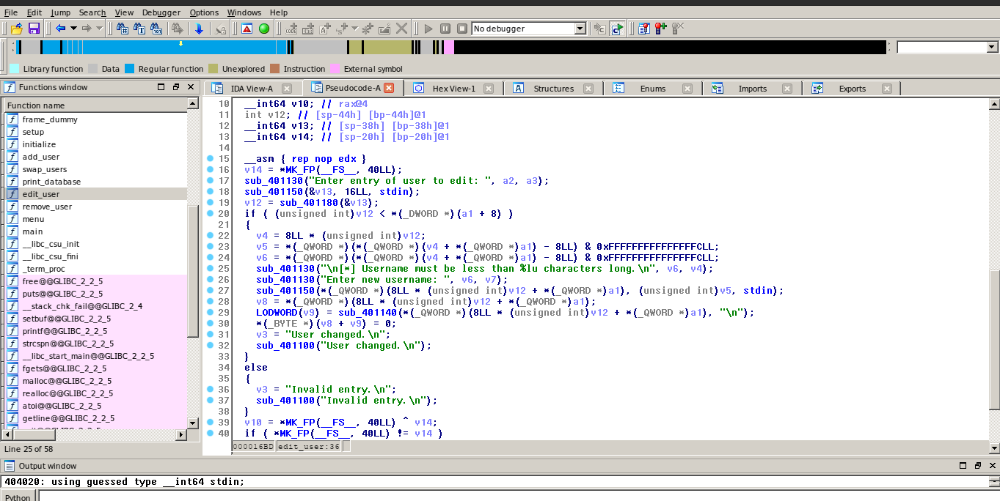
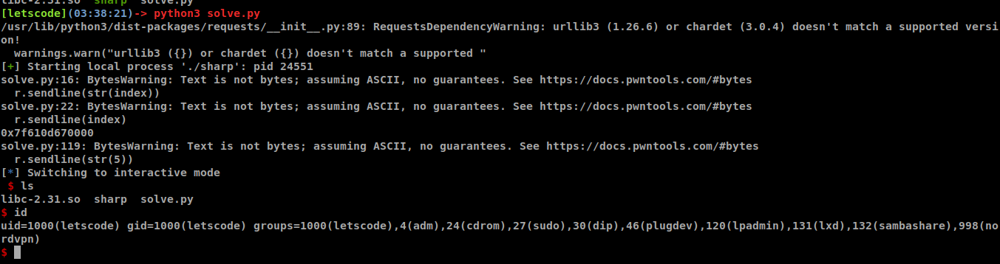

# Problem

```sh
At the time I solve this, the event was over and the web server is down. 
So I can't copy the description of this challenge here but I still have these files. 
Take a look and enjoy :vv
Attachments: [libc-2.31.so] and [sharp] 
```

# Solution
- After downloading [sharp](challenge/sharp), just open it in IDA-64bit and you will see the vulnerabilty in `edit_user` function. Look at `line 27`, it uses `fgets` (`sub_401150`) to `edit` our chunk, but the **bug** is in `v5 variable` - it is the `second argument` of `fgets` and it is taken from it's `chunk.size` (`line 23`) - that means we have `heap overflow` `0x10 bytes` here. In fact, if we change the `nextchunk.size`, we have `unlimited` `overflow` in `heap`.



- Now, we have the vulnerability. There is only 2 things left: leak `libc_base addres` and overwrite `__free_hook`.

- First I'll set up a plan to leak `libc_base address`, of course it's an idea, you have to change a little bit to suit with this challenge, and I've done it in the [exploit script](solve/solve.py), you can take a look at it:
	+ Create 5 `chunk` with size as follow: 0x80, 0x790, 0x80, 0x790, 0x80 
	+ `Free` `chunk2`, now `chunk2.fd` and `chunk2.bk` will have address of `main_arena+96`
	+ `Edit` `chunk1` to overwrite `chunk2.size` to **0x790 + 0x80**  (for my note: maybe I miss something here)
	+ `Edit` `chunk3` to overwrite `chunk4.prev_size` to **0x790 + 0x80** and `chunk4.size` to **0x790**
	+ `Free` `chunk4` and we have a `BIG` **FREE** `chunk` with `size` **0x790 + 0x80 + 0x790**. **BUT** we have **1 in_used chunk** with size of **0x80** inside `that big FREE chunk`.
	+ Now just `create` a `chunk` with size of `0x790`, then `chunk3.fd` and `chunk3.bk` will be overwrited by `main_arena+96`. Since `chunk3` is still `in_used` so we can use `print_database` function to leak `that address` in `chunk3.fd` out.
	+ Now we have `libc_base address`.

- Make the second plan to overwrite `__free_hook`. Basically, the `technique` I use to overwrite `__free_hook` is the same as the one I use to exploit **Pawned** challenge. The idea will be:
	+ Create 4 `chunk` as size: 0x80, 0x80, 0x80, 0x80. Well, the `size` of the 2 `first chunk` is any, the `size` of 2 `last chunk` is **same size** and **< 0x400**.
	+ `Free` `chunk4` and then `free` `chunk3`
	+ `Edit` `chunk1` to overwrite `chunk2.size` to `0x81 + 8`
	+ `Edit` `chunk2` to overwrite `chunk3.fd` to `__free_hook address`
	+ Now `malloc` 2 times with size of `0x80`. But at the `second time`, `malloc` will return `__free_hook address` to us, and we just write `system libc address` in it.
	+ Now we can `free` any `chunk` which have `/bin/sh` string on it **AND WE GET SHELL** :##

- You can find the [exploit script here](solve/solve.py)



## Thanks for reading :xD
