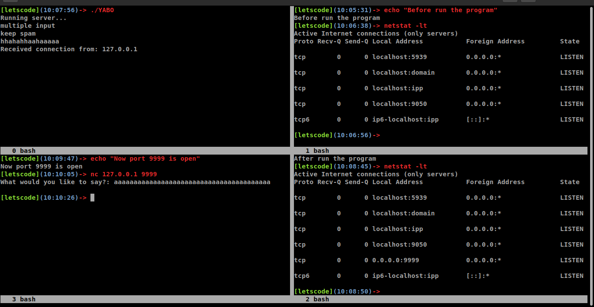
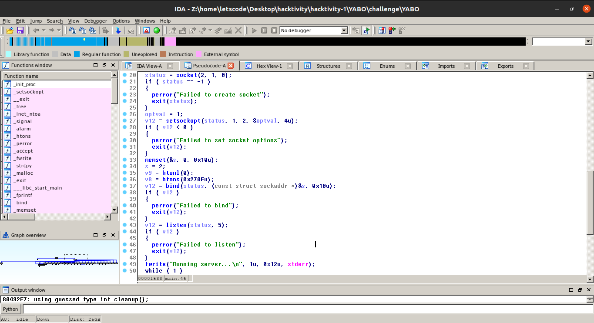
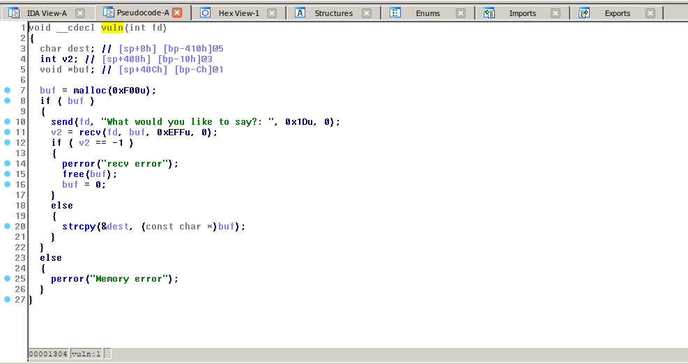
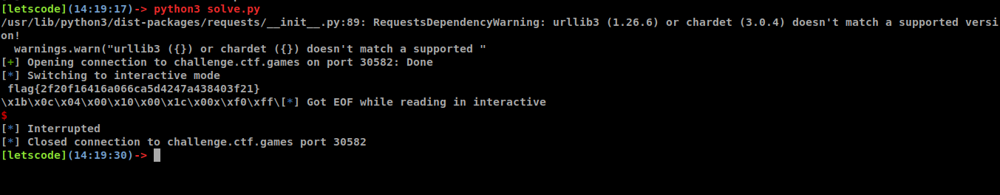

# Problem

```sh
Author: @M_alpha#3534

Yet Another Buffer Overflow.

Some certifications feature a basic windows buffer overflow. Is the linux version really that different?

Download the files below and press the Start button on the top-right to begin this challenge.
Attachments: [YABO] 
```

# Solution
- After downloading [YABO](challenge/YABO), let's run the binary file to see what it does. It prints an output, and let our send multiple inputs without responding (`bash 0` picture) . It looks like the program open a new port in our machine and waiting for a new connection to that port. Let's check it with `netstat` and ... that's true... wait a sec (`0.0.0.0` :xD). After we connect to that port, we recieve an output, and it allow us to send one input, then that connection will be closed, but port 9999 is still open and waiting for the other connections.  




- Let's take a look at `main` function in `IDA`. Before the program print output "Running server...", it sets up a `socket` and `bind` it to a `listening port`. After that it calls `vuln` function. Before we go to that function, let's me explain what the `main` function does. As you know, when you write a program, if you want to run it just simple run it because you have that file :vv. But if you want the other people run the binary file without that binary file :vv, you need to `bind` it to an `open port`, for me, I usually use `ncat`: `ncat -e ./binary -lk x.x.x.x xxxx`. So other people can connect to that `address` and `interactive` with the `binary program`. In short, we need 2 things: create binary file and run it in a listening port. Well, in this challenge, the `bianry`'ve already created a `listening port` itself and the code we'll interactive when connecting to `that port` is in `vuln` function. So if you run the binary file in local, the program you really want to interactive is actually running on `port 9999`. Ok now let's see what the program does in `port 9999`, it is in `vuln` function.




- Well, in `vuln` function, you see the vulnerability right? it allows us to send input to the port it opens in `main`, and store our input in heap, the max length of our input is 0xEFF bytes. But after that, it `copy` our input to `stack` with `strcpy`, and the `local varibale dest` is created to store only 0x400 bytes -> that means we have `stack overflow` here, after checking `checksec` we know that this `binary` have no `canary`, no `NX` --> that means `shellcode` for sure. But you need to remember that: our input must not include `\x00` byte because `strcpy` will copy our string until finding `\x00` byte. Now, we find the vulnerabilty - `stack overflow` just like previous **shelle-2** challenge, but the way we exploit this vulnerability is totally different. Let's check it out. 





- Because of `strcpy`, we can't use `ROP chain` technique as previous **shelle-2** challenge. Now we know we need `shellcode`, but if you want to use `shellcode`, you need to figure out `shellcode address` first. We don't know the `address of our input` in both `heap` and `stack`. So we don't know `shellcode address`, that means despite controlling `eip` but we don't know where `eip` should point to ??? We're stuck :TT 

- This time, there is a **really powerful ROPgadget**, and this is the **first key** to solve this challenge, you must figure out how it works by yourself :xx


- Now we just put our `shellcode` behind that `ROPgadget address` and our `shellcode` will be executed in `stack` :haha__not_so_fast

- As usual, writing a `exec shellcode` without `\x00` byte is very easy. Then I wrote code and sent `payload` with the `shellcode` inside ... but I din't get the shell ... Ok let's get back and take a look at how the program works again :vv

- In the `vuln` function, we overwrite it's `return address` by `ROPgadget address`, after `ROPgadget` is executed, `eip` will store our `shellcode address` and execute it. This time, our shellcode will be executed ... that's true. But I forgot 1 thing, when the `shellcode` execute, it create a `new sub process` `/bin/sh`, and **that process reads input from fd 0, and writes output to fd 1**. Because this binary create a `socket` by itself, and as you can see in `vuln`, the binary read our input from **fd 4** NOT **fd 0**, so the process `/bin/sh` doesn't read our `shell command` when we send it. That's reason why I fail when I write the `shellcode` in this way.

- I have an idea to build a `shellcode` like this: **open file flag, read it into writable memory, creating socket, sending the flag to the outside server**. It'll work, I know, but writing `this shellcode` is a little bit complex, so I got the better idea: **open file flag, read it into writable memory, write the flag to fd 4**. Yes, **fd 4**, the program interactive with us via `fd 4`, so if the program send `the flag` to `fd 4`, we will recieve it :xD 

- And this is my `shellcode`, it's based on [this docs](https://syscalls32.paolostivanin.com/):

```sh
0:  31 c0                   xor    eax,eax
2:  50                      push   eax        ; make sure filename end with \x00
3:  68 2e 74 78 74          push   0x7478742e ; "txt."
8:  68 66 6c 61 67          push   0x67616c66 ; "galf"
d:  89 e3                   mov    ebx,esp    ; set ebx = address of "flag.txt"
f:  31 c9                   xor    ecx,ecx
11: 31 d2                   xor    edx,edx
13: 34 05                   xor    al,0x5     ; eax = 5 for open syscall-32bit
15: cd 80                   int    0x80       ; open("flag.txt"), return value is **fd** of file flag.txt and its stored in eax
17: 89 c3                   mov    ebx,eax    ; ebx will hold fd of file flag.txt, if I am not wrong, its 5
19: b9 11 b1 04 08          mov    ecx,0x804b111      ; 0x804b111 this is a writable address
1e: 80 f2 40                xor    dl,0x40    ; edx is size, its number of byte in file flag.txt will stored in this address 0x804b111
21: 31 c0                   xor    eax,eax
23: b0 03                   mov    al,0x3     ; eax = 3 for read syscall-32bit
25: cd 80                   int    0x80       ; read( fd_5, 0x804b111, 0x40 )
27: 31 c0                   xor    eax,eax
29: 34 04                   xor    al,0x4     ; 
2b: 89 c3                   mov    ebx,eax    ; fd 4
2d: 31 c0                   xor    eax,eax
2f: 34 04                   xor    al,0x4     ; eax = 4 for write syscall-32bit, ecx and edx is the same as previous read syscall
31: cd 80                   int    0x80       ; write(fd_4, 0x804b111, 0x40)
```

- Well that's all and we can get the flag, you can find the script [here](solve/solve.py)




## Thanks for reading :xD