# Problem

```sh
493 points - Binary Exploitation - 27 Solves - medium

Author: @M_alpha#3534, @fumenoid#9548

Professor Shelle was mad that everyone bypassed her psuedo shell and read the flag, Now she removed the vulnerability and thinks that the new strict-psuedo shell is secure.. hah, time to prove her wrong.

Download the files below and press the Start button on the top-right to begin this challenge.
Attachments: [Dockerfile] and [shelle-2] 
```

# Solution
- After downloading 2 files [Dockerfile](challenge/Dockerfile) and [shelle-2](challenge/shelle-2), let's run the binary file to see what it does. It looks like have a while loop allowing us to send input multiple times, print the same output, and the program exits when we send "exit" string.


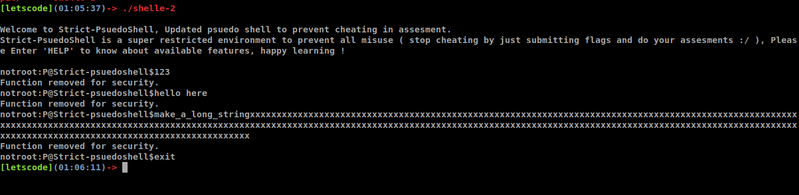

- After making some simple checks, we have a lot of useful information:
	+ This file is ELF 64-bit, dynamically linked and not stripped.
	+ With the `Dockerfile`, we know this binary run on `Ubuntu 20.04 LTS`, and because it is dynamically linked, it uses this libc file `libc-2.31.so` version.
	+ Checking the binary protection, we see `Canary` is `ENABLE` - we can't use StackOverflow Attack (maybe), `NX` is `ENABLE` - we can't execute shellcode (maybe), `RELRO` is `FULL` we can't overwrite GOT Table (maybe). But `PIE` is `disabled` so we don't need to find and calculate the binary address.
	+ Because it's dynamically linked so we can check which library function the program uses. It seems the program just get input, compare, copy, print output but doesn't `open` file or use `system` function.  


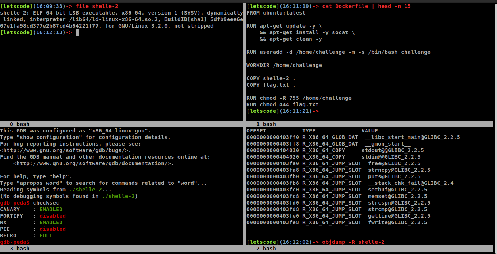

- By using IDA, we can see this program after going to `main`, it calls the `run_cmds` function. In `run_cmds` function, at `line 30` we can see it calls `sub_401150`, after checking in text-view of `IDA` or `gdb` we know it's `getline` function.  By checking how `getline` works with `man`, and the code at four lines 18, 29, 30, 69 - We know everytime the `getline` function is called, the first and the second argument are stack's address and they point to `NULL` value, so basically we can send unlimited byte (including `Null` byte, ending with byte `newline` :vv) to server and our input will be stored in `heap` segment and it return our `input heap address` into the first argument of `getline`. So it just returns heap address into stack -> no overflow in both stack and heap here :xD  


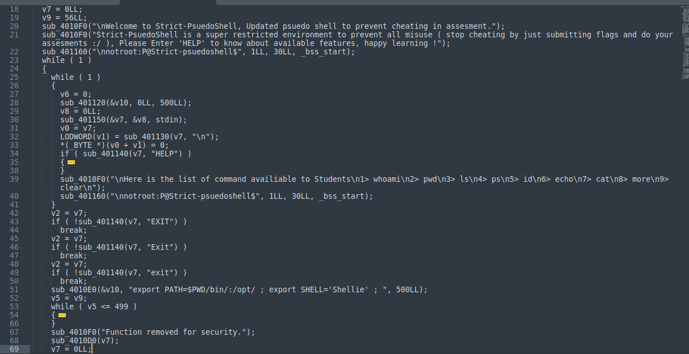
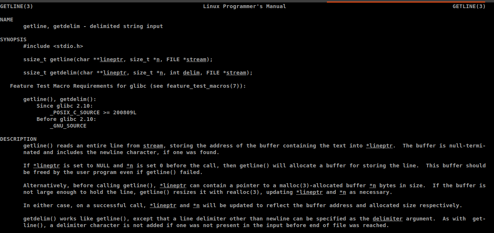

- Let's scroll down and we can see the `while` loop in `line 53`, it copies first 444 bytes (it won't copy `NULL` byte and `\` byte but still increasing both buffer's index at `heap` and `stack`) from our input at `heap` to `stack` and it's safe because the variable in stack was created to store our 444 bytes, besides the `run_cmds` function have `Canary` anyway. But wait a second, the code doesn't actually act like that: it copies a single byte at time, but if that byte is `\`, it **does not increase byte counting (v5)**. This means if we send 445 bytes and that input have one `\` byte, it will copy other 444 bytes and at the position of `\`, it won't copy that byte but still **increase both 2 buffer's index**  -> that means we just overflow 1 byte in stack. By keeping building payload in that way we can overflow the whole `stack` and accidentally we just bypass `canary` by filling 8 bytes `\` at `canary position`. So now we find the vulnerability here, it's easy, right? but stay cool because the process of building an attack is not just easy like that :vv


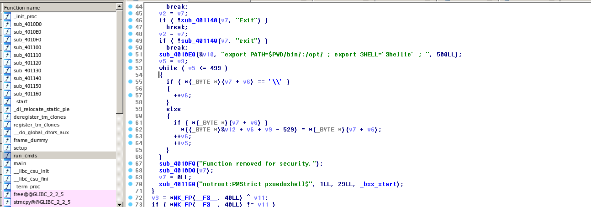

- With overflow in stack we can control `rip` by overwriting return address of `run_cmds` function. But now the question is where do we go??
	+ All custom function like `main`, `run_cmds` don't print `flag` for us
	+ Import library functions don't include `system` for executing shell command

---> No available code in the program can help us get `flag`

---> We build the new program by ourselves.

- As nornal I will write an `exec shellcode` and make the `rip` point to `address of that shellcode`, but in this program `NX` protection is `ENABLE`, this means there is no where in the process memory can help us execute our shellcode because all `writable memory segments` won't have `executable bit`. So we can not control the program with `shellcode`.


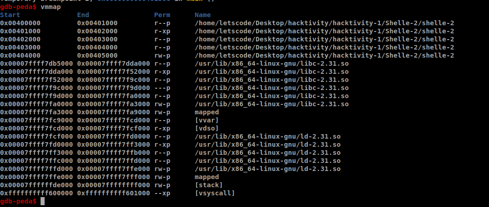

- Well, there is must be another way to get flag, it's `system` function, stored in library file `/usr/lib/x86_64-linux-gnu/libc-2.31.so`  and this is the reson why the author give us the Dockerfile to find out which version of libc the binary uses in the server. Now we have `libc` file but we don't have the `system` function `address` because the address saved in `libc` file is just `offset` and when the process loads that `libc` file, all the `functions` and `global variables` will have the new address (it just creates a new `random libc base address` (`0x00007ffff7db5000` in above picture :uhm remember this **The last 12 bits of any base address segment will be 0**) and adds with that function/varibale `offset` ). So now we have `system offset` (in the below picture.. my libc version is the same at the one on remote server :xD) and we need to find `libc base address`. To  get the `libc base address` we need to find any `libc function address` like `puts` for example and then we minus the `offset` of that `puts` function in `libc` file and ... we have the `libc base address` :vv


- Maybe you wonder why I use `puts` to leak `libc base address`, because our binary `shelle-2` use `puts` to print string, so when `puts` is called in `run_cmds` function, the program will load `libc puts address` into `GOT table` (below picture is GOT Table, it stores all `libc function address` **after** these function is called **the first time** in the program). So we know where to get these `libc function address`, you can choose your `libc function` as you want **but** make sure it doesn't contain `\x00` byte or `\x0a` byte. Besides `PIE` is `DISABLE` in this binary so all address saved in `shelle-2` file won't be changed and we have `address of GOT Table` by the way. Now the `libc puts address` we are finding is stored as a value in this `0x0000000000403fb0` address of GOT Table. We can use `puts` function to print this value out. Well, as you can see my previous sentense, **it's not simple as you see**, there are alot of questions around this I can't explain all in this writeup. So make sure you can answer all the questions below, if you don't you can't understand the next part :TT 
	+ How to call `puts` function?
	+ How many `address` of `puts` function?
	+ What is the `argument` of `puts` function?
	+ Where is the `argument`  stored when `puts` function is called? 


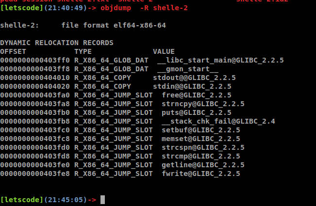

- So now we go into the harder part of this challenge. Let's make the plan:
	+ First, we can not return directly to `puts` function because we have not set the argument of `puts` yet. So now we need ROPgadget technique to set `rdi` register as `puts's argument`. The ROPgadget we use is `pop rdi ; ret`. So we'll overwrite `return address` of `run_cmds` function with `that ROPgadget address` - 0x00000000004015f3, the next `stack entry` will be `argument of puts` - `0x0000000000403fb0` because when `rip` in address of that ROPgadget, `rdi` will take that value.
	+ Second, after setting `puts's argument` the `rip` register will point to the next `stack entry` where we will overwrite with `puts address` - 0x4010f0 (NOT `libc puts address` :xD)
	+ Third, after `puts` function is executed, the `rip` register will point to the next `stack entry`, but what we'll overwrite in this `stack entry` this time, where do we go?? Remember that when `puts` function is executed, it's print out the `libc puts address` we can catch `that address` and calculate `libc system address`. So all we need now is going to `main` function **again**, make use of `stack overflow vulnerability` to overwrite `return address` of `run_cmds` by the `libc system address`. So this `stack entry` will be `main address`.
	+ So after back to `main`, we can overwrite `return address` of `run_cmds` with `libc system address` but remember `system` need an `argument` just like `puts`. But the argument of `system` is `address` of string "/bin/sh\x00", we can find the `offset` of `that string` - `0x1b75aa` in `libc` file. After adding `libc base address`, we have `address` of "/bin/sh" as argument of `system`, use the `ROPgadget` just like `First step` to setup `stack entry` and we're done.
	+ Well in theory it works, but in fact it doesn't. So let's move to the hardest part and bypass it :xD 


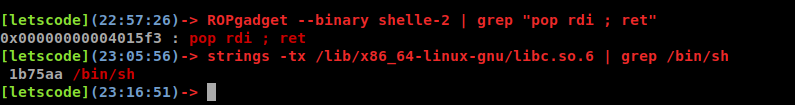

- This is the hardest part of this challenge we need to bypass. As you can see the picture below, there are 20 `stack entry`. The `first stack entry` stores the `return address` of `run_cmds` function, it'supposed to back to `main + 28`, but after we overwrite this `stack entry` with `ROPgadget address` like `previous first step`, it's no longer go back to `main` and execute as the plan we made. But the problem is: When it copy our input from `heap` to `stack`, **it doesn't copy NULL byte**. For example, look at `stack entry 3`, before we overwrite, it stores this `0x7ffff7ddc0b3` value, as previous plan we will overwrite this entry with `puts address` - `0x4010f0`. But because it can not copy `NULL` byte, after overwriting, `stack entry 3` will be `0x7ffff74010f0` and that is not `puts` address. So this is the reason why our previous plan fails. 


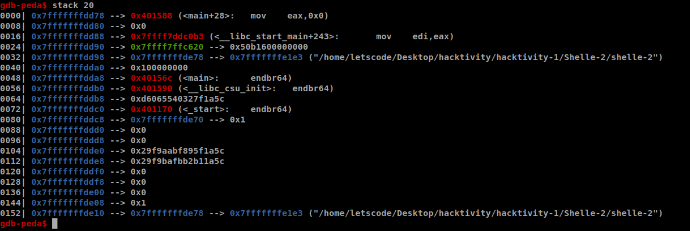

- Ok let's bypass this:
	+ First, As previous plan, we need 4 `stack entry` to setup: `rop_address`(0x00000000004015f3), `got_puts_address`(0x0000000000403fb0), `puts_address`(0x4010f0), `main_address`(0x40156c). And you can see the common between these address is **first 5 bytes is zero, and the rest 3 bytes is not**. So as previous plan, we pass `stack entry 1, 2` but we fail at `stack entry 3, 4`. So we need new plan, let's look at the `stack` at the above picture, we need to find a place to store `4 addresses` and you see that, right, yes it is at `stack entry 16`. There is 4 continuous "empty" `stack entry` start at `stack entry 16`. And we will store these 4 addresses in here.
	+ Second, How can we make `rip` point from `stack entry 1` to `stack entry 16` :xD. Well, we'll use ROPgadget again. - `pop5_ret`, `pop5_ret`, `pop2_ret` - and we can make `rip` point to `stack entry 16`. Well let's me explain.
	+ You know `rip` will point to `stack entry 1`, after executing the `pop5_ret` (pop 5 times and ret - 0x4015eb), `rip` will point to `stack entry 7`. In here, look at the value before we overwrite, it has already empty first 5 bytes, so we can place the next `ROPgadget address` here. Next, we have +2 options: (`pop5_ret` and `pop2_ret`) or (`pop4_ret` and `pop3_ret`). All these 2 options can make `rip` point to `stack entry 16` for us. But I use the first one, because `rop5_ret` make `r15` become 0, and I use `one_gadget` instead of `system`. About `one_gadget`, it is alternative technique for `system`, and how to use it? It is a a little bit longer story, search google for it - it's easy to understand - trust me. But if you use `system` to get shell, both 2 above options are fine. 


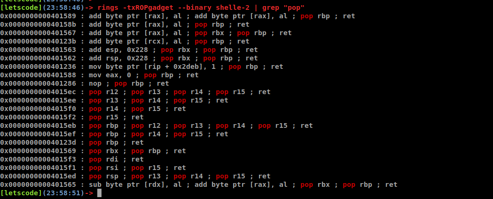


- That's all the problem you have to bypass to solve this challenge. The exploit script is [here](solve/solve.py). 


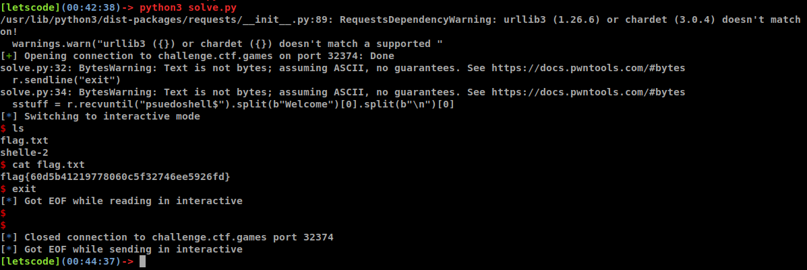

## Thanks for reading :xD