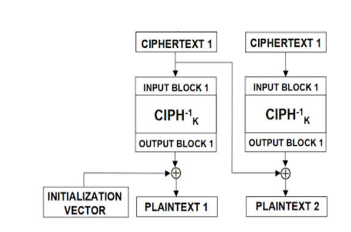

# Triforce - 444pt

--------------------------------------------------------------------

## Description

This problem gives us two files, one is `output.txt` and the other is `sausage_links.py`. As follows:

### server.py

```py
#!/usr/bin/env python3

import os
import socketserver
import string
import threading
from time import *
from Crypto.Cipher import AES
import random
import time
import binascii

flag = open("flag.txt", "rb").read()
piece_size = 16
courage, wisdom, power = [
    flag[i : i + piece_size].ljust(piece_size)
    for i in range(0, piece_size * 3, piece_size)
]

banner = """
           /\\
          /  \\
         /    \\
        /      \\
       /        \\
      /__________\\
     /\\__________/\\
    /  \\        /  \\
   /    \\      /    \\
  /      \\    /      \\
 /        \\  /        \\
/__________\\/__________\\
\\__________/\\__________/
= = =  T R I F O R C E = = =
HELLO SPIRIT, WE WILL GRANT YOU ONE PIECE OF THE TRIFORCE:
         1. COURAGE    2. WISDOM    3.  POWER
WITH THIS PIECE YOU MAY ENCRYPT OR DECRYPT A SACRED SAYING.
    YOU HOLD THE SECRETS OF THE GODS WITH THIS TRIFORCE
"""


class Service(socketserver.BaseRequestHandler):
    def handle(self):

        self.send(banner)
        self.triforce = self.select_piece()
        if not self.triforce:
            return

        while True:
            self.send("1: ENCRYPT A SACRED SAYING")
            self.send("2: DECRYPT A SACRED SAYING")
            self.send("3: SELECT A NEW TRIFORCE PIECE")
            self.send("4: RETURN TO YOUR ADVENTURE")
            choice = self.receive("select# ").decode("utf-8")
            if choice == "1":
                self.encrypt_sacred_saying(self.triforce)
            elif choice == "2":
                self.decrypt_sacred_saying(self.triforce)
            elif choice == "3":
                self.triforce = self.select_piece()
            elif choice == "4":
                self.send("MAY THE GODS OF HYRULE SMILE UPON YOU.")
                return

    def send(self, string, newline=True):
        if type(string) is str:
            string = string.encode("utf-8")

        if newline:
            string = string + b"\n"
        self.request.sendall(string)

    def receive(self, prompt="> "):
        self.send(prompt, newline=False)
        return self.request.recv(4096).strip()

    def magic_padding(self, msg):
        val = 16 - (len(msg) % 16)
        if val == 0:
            val = 16
        pad_data = msg + (chr(val) * val)
        return pad_data

    def encrypt_sacred_saying(self, triforce):
        self.send("PLEASE ENTER YOUR SACRED SAYING IN HEXADECIMAL: ")

        sacred = self.receive("encrypt> ")
        sacred = self.magic_padding(str(binascii.unhexlify(sacred)))
        cipher = AES.new(self.triforce, AES.MODE_CBC, iv=self.triforce)
        saying = cipher.encrypt(sacred.encode("utf-8"))

        self.send("THANK YOU. THE GODS HAVE SPOKEN: ")
        self.send(binascii.hexlify(saying).decode("utf-8") + "\n")

    def decrypt_sacred_saying(self, triforce):
        self.send("PLEASE ENTER YOUR SACRED SAYING IN HEXADECIMAL: ")

        saying = self.receive("decrypt> ")
        saying = binascii.unhexlify(saying)
        if (len(saying) % 16) != 0:
            self.send("THIS IS NOT A SACRED SAYING THAT THE GODS CAN UNDERSTAND")
            return
        cipher = AES.new(self.triforce, AES.MODE_CBC, iv=self.triforce)

        sacred = cipher.decrypt(saying)
        self.send("THANK YOU. THE GODS HAVE SPOKEN: ")
        self.send(binascii.hexlify(sacred).decode("utf-8") + "\n")

    def select_piece(self):
        self.send("WHICH PIECE OF THE TRIFORCE WOULD YOU LIKE? (1,2,3)")
        piece = self.receive("triforce# ").decode("utf-8").strip()
        for i, triforce in enumerate([courage, wisdom, power]):
            if piece == str(i + 1):
                piece = triforce
                return piece
        else:
            self.send("THIS HERO OF TIME IS STUPID. PLZ PICK A REAL TRIFORCE PIECE.")
            return False


class ThreadedService(
    socketserver.ThreadingMixIn,
    socketserver.TCPServer,
    socketserver.DatagramRequestHandler,
):
    pass


def main():

    port = 3156
    host = "0.0.0.0"

    service = Service
    server = ThreadedService((host, port), service)
    server.allow_reuse_address = True

    server_thread = threading.Thread(target=server.serve_forever)

    server_thread.daemon = True
    server_thread.start()

    print("Server started on " + str(server.server_address) + "!")

    # Now let the main thread just wait...
    while True:
        sleep(10)


if __name__ == "__main__":
    main()
```

--------------------------------------------------------------------

## Solve

The flag is split into 3 parts has 16 bytes. When we connect to the server, we are asked to select a piece of the triforce, each piece corresponds to part of the flag.

Look at the decrypt function

```py
    def decrypt_sacred_saying(self, triforce):
        self.send("PLEASE ENTER YOUR SACRED SAYING IN HEXADECIMAL: ")

        saying = self.receive("decrypt> ")
        saying = binascii.unhexlify(saying)
        if (len(saying) % 16) != 0:
            self.send("THIS IS NOT A SACRED SAYING THAT THE GODS CAN UNDERSTAND")
            return
        cipher = AES.new(self.triforce, AES.MODE_CBC, iv=self.triforce)

        sacred = cipher.decrypt(saying)
        self.send("THANK YOU. THE GODS HAVE SPOKEN: ")
        self.send(binascii.hexlify(sacred).decode("utf-8") + "\n")
```

Decryption is performed with AES-CBC, using part of the flag for IV and KEY. Our task is to find IV for each piece to get  the flag.

To get IV, we use the diagram below:

Suppose we send ciphertext consisting of two identical blocks C = C1|C1 to decrypt it and get the plaintext P = P1|P2.

+ D(C1) XOR IV = P1 => IV = D(C1) XOR P1
+ D(C1) XOR C1 = P2 => D(C1) = P2 XOR C1
+ => IV = P2 XOR C1 XOR P1
  
Here is my code:

```py
    from pwn import *
from Crypto.Util.number import long_to_bytes, bytes_to_long
import binascii

conn = remote('challenge.ctf.games', 31462)
conn.recvuntil('triforce# ')
conn.sendline('1')

def get_decrypt(enc):
    enc = binascii.hexlify(enc)
    conn.recvuntil('select# ')
    conn.sendline('2')
    conn.recvuntil('decrypt> ')
    conn.sendline(enc)
    conn.recvline()
    msg = binascii.unhexlify(conn.recvline().decode()[:-1])
    return msg

def get_iv(mode):
    conn.recvuntil('select# ')
    conn.sendline('3')
    conn.recvuntil('triforce# ')
    conn.sendline(mode)
    cipher = b'0'*16
    plain =  get_decrypt(cipher*2)
    iv = long_to_bytes(bytes_to_long(cipher) ^ bytes_to_long(plain[:16]) ^ bytes_to_long(plain[16:]))
    return iv
print(get_iv('1') + get_iv('2') + get_iv('3'))
```
