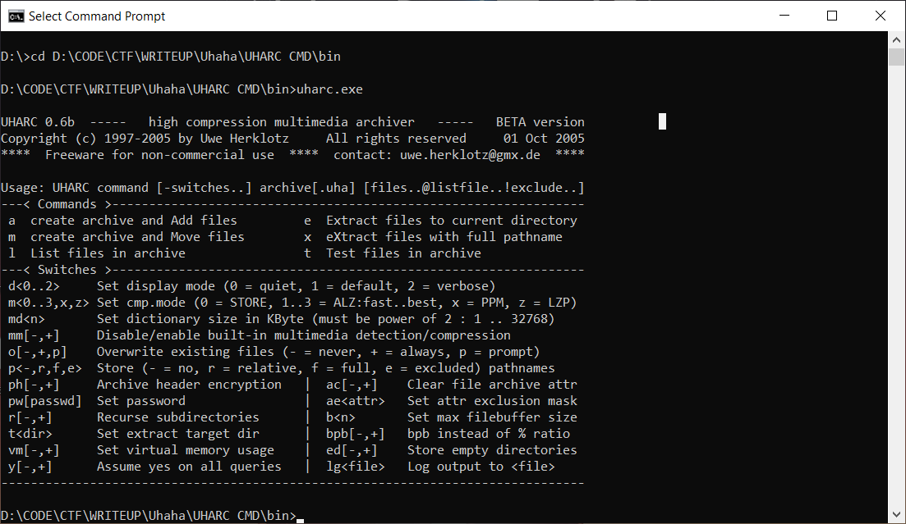
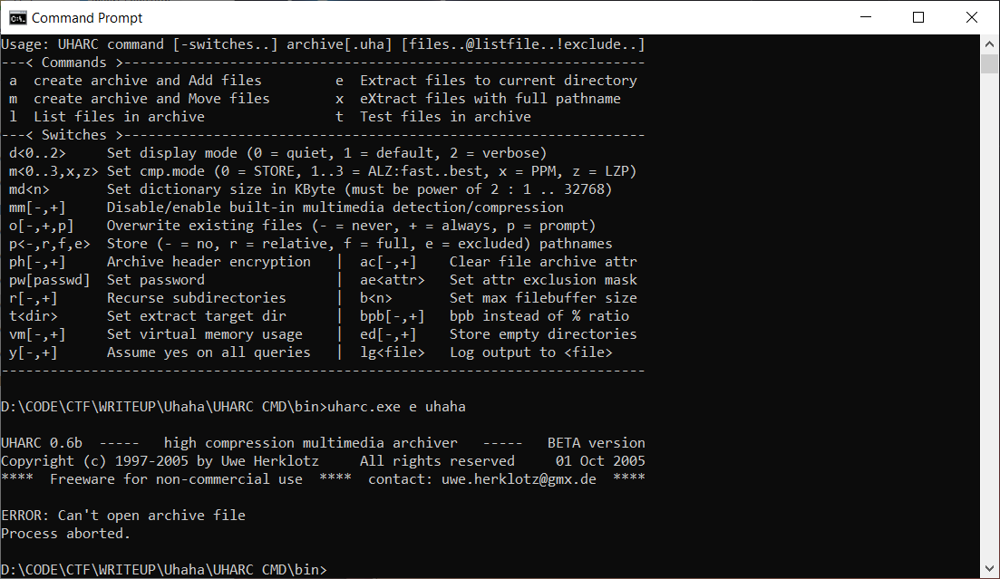
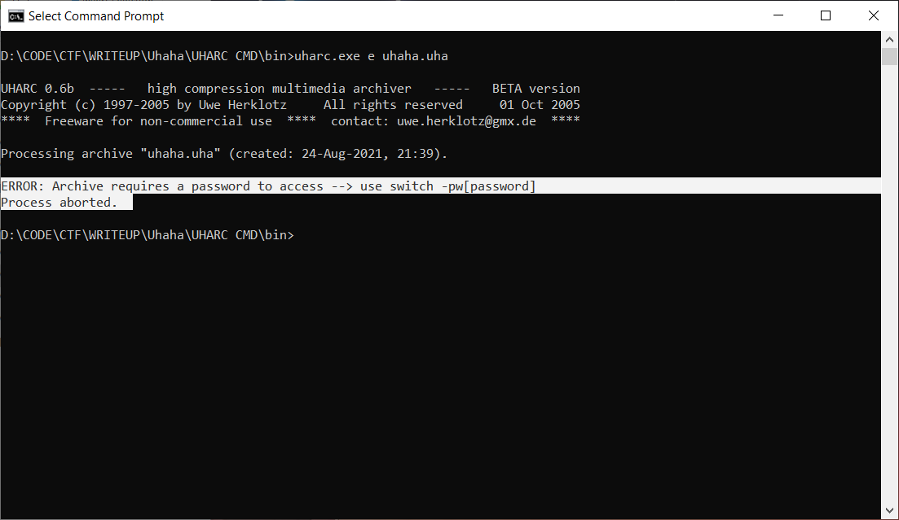
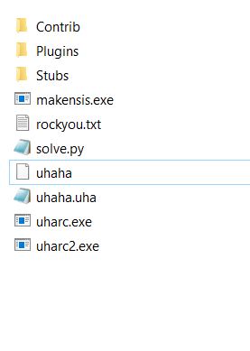
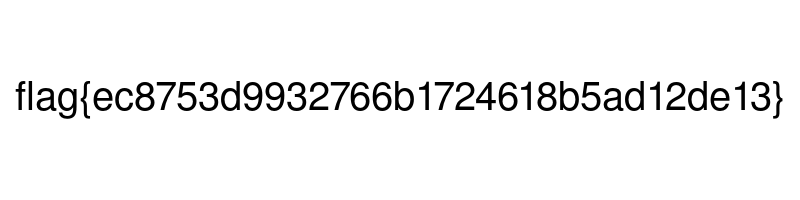

# PROBLEM
* We have uharc file and we need find flag from it

# HINT
* File name: uhaha
* File type: uharc
* File password: rockyou.txt
* Shouldn't need more than top of 100 password in rockyou.txt
# DISCOVER
## Download uharc 
https://sam.gleske.net/uharc/
## Check option

## Try extract file uhaha but get this error

## Rename file uhaha to uhaha.uha, extract again. Hmm, i need password to extract this file


##  I try brute-force password by using file rockyou.txt, then i get another file uhaha -_-


# SOLVE
* We need brute-force one more time to get the flag
* Rename uhaha to uhaha.uha
* Use option -o+ to overwrite old file uhaha.uha
* Use option -pw to enter password
* Don't click or use the keyboard during executing this script


```python
from pyautogui import  sleep
import os
import keyboard
import threading
from pathlib import Path

def press_and_release_keys(keys):
    for key in keys:
        keyboard.press_and_release(key)
    keyboard.press_and_release('enter')
    for key in keys:
        keyboard.press_and_release(key)
    keyboard.press_and_release('enter')
    sleep(0.01)
    for path in Path.cwd().iterdir():
        if path.is_file():
            old_name = path.stem
            old_extension = path.suffix
            if old_extension=="" and old_name=="uhaha":
                if (Path.cwd()/"uhaha.uha").is_file():
                    os.remove("./uhaha.uha")
                directory = path.parent
                new_name = old_name + ".uha"
                path.rename(Path(directory, new_name))


list_pass = []
with open("./rockyou.txt","r") as f:
    for _ in range(150):
        list_pass.append(f.readline().strip())

for chap in range(150):
    for cnt in range(len(list_pass)):
        p = list_pass[cnt]
        print(f"{cnt}/{chap}: {p}")

        t1 = threading.Thread(target=os.system, args=(f"uharc.exe e -pw -o+ uhaha.uha",))
        t2 = threading.Thread(target=press_and_release_keys, args=(p,))
        
        t1.start()
        t2.start()
        
        t1.join()
        t2.join()
```

# FLAG

